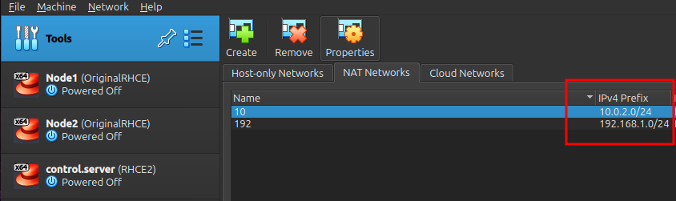
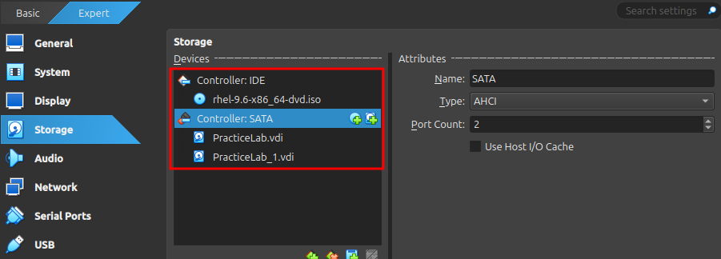
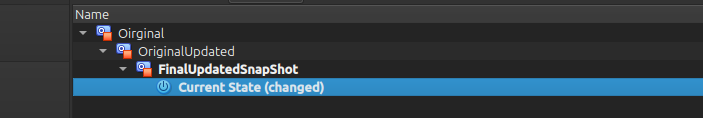
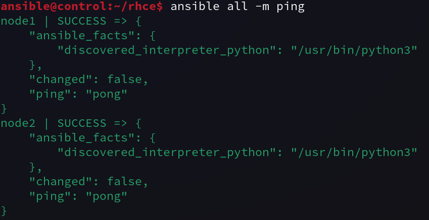

# RedHat-RHCE-Notes

## Table of Contents

  - [Introduction](#intro)
  - [Lab Setup](#lab)
  - [Inventory and Ansible.cfg](#files)
  - [Modules and Collections](#mod)
  - [Playbooks](#plays)
  - [Variables](#vars)
  - [Facts](#facts)
  - [Loops and Conditionals](#loops)
  - [File Management Modules](#files)


## <a name="intro"></a>Introduction 
I passed the RHCSA exam 300/300. Now I am taking on the RHCE certification. This is a compilation of my lab setup, some notes, and some playbooks. 

## <a name="lab"></a>Lab Setup
For the lab I decided to use VirtualBox. I downloaded a rhel-9.6.iso with my Red Hat developer account. I setup a control node with a GUI to run ansible and 2 managed nodes with the minimal install (no gui).

***I configured the managed nodes with 2 network interfaces each on their own network for any networking playbooks. I will use the "192" network for the main communication and the "10" network to run any networking playbooks on***
<p align="center"></p>

***I added an extra hard disk which will be on /dev/sdb for any Partitioning and LVM playbooks. I added the rhel iso to mount and create a local repository for each node to install packages from which will be on /dev/sr0. I also practiced with using the control node to mount the rhel iso and to host an HTTP repo and connect the nodes to it.***
<p align="center"></p>

***After I had configured everything I made sure to take snapshots, so that I could easily start over with a fresh lab and not have to setup all the minuscule tidbits again. Highly recommend***
<p align="center"></p>

***I now have the lab setup with the user "ansible" on all nodes who has NOPASSWD sudo privs(insecure) but great for RHCE and convenience. I used ssh-keygen then ssh-copy-id for user ansible to copy the key over on both nodes. Everything is now setup and working.***
<p align="center"></p>

## <a name="files"></a>Inventory, Ansible.cfg, and Hosts Files
For this simple network I used a static inventory file in my current project directory. In a minimal form, a static inventory is a list of hostnames to be managed by Ansible. The inventory tells Ansible which machines to manage (hosts and groups)

```shell
$ mkdir rhce && cd rhce
$ cat inventory 
[dev]
node1

[prod]
node2

[servers:children]
dev
prod
```

The ansible.cfg file defines Ansible’s configuration settings — it controls things like inventory location, privilege escalation, logging, and connection options.

```shell
$ cat ansible.cfg
[defaults]
# (pathlist) Comma separated list of Ansible inventory sources
inventory = inventory

# (string) Sets the login user for the target machines
# # When blank it uses the connection plugin's default, normally the user currently executing Ansible.
remote_user = ansible

# (boolean) This controls whether an Ansible playbook should prompt for a login password.
# If using SSH keys for authentication, you probably do not need to change this setting.
ask_pass = false

[privilege_escalation]
# (boolean) Toggles the use of privilege escalation, allowing you to 'become' another user after login.
become = true

# (string) Privilege escalation method to use when `become` is enabled.
become_method = sudo

# (string) The user your login/remote user 'becomes' when using privilege escalation, most systems will use 'root' when no user is specified.
become_user = root

# (boolean) Toggle to prompt for privilege escalation password.
become_ask_pass = false
```

We also need hostname resolution to address managed hosts by name. I will use /etc/hosts for this

```shell
$ cat /etc/hosts
127.0.0.1   localhost localhost.localdomain localhost4 localhost4.localdomain4
::1         localhost localhost.localdomain localhost6 localhost6.localdomain6
192.168.1.100	control.server control
192.168.1.10	node1.local node1
192.168.1.20	node2.local node2
```

## <a name="mod"></a>Modules and Collections
Modules are the individual units of work in Ansible — they perform specific tasks on managed hosts, like creating users, copying files, or installing packages. Collections are packages that bundle related Ansible content (modules, plugins, roles, and documentation) together for easier sharing and reuse. 

```shell
# you can use ansible-doc to get info on a module
$ ansible-doc user # the module to create users. shows options and examples
$ ansible-doc -l # print all available modules

# to install extra collections you use ansible-galaxy
# these collections will give you all you need to run playbooks along with ansible.builtin
# you will now have access to ansible.posix.firewalld to run playbooks to edit firewall rules
$ ansible-galaxy collection install community.general
$ ansible-galaxy collection install ansible.posix
```
```shell
# you can install collections directly from an http link
$ ansible-galaxy collection install http://example.com/path/to/collection.tar.gz

# you can also install them from a requirements.yml file:
$ cat requirements.yml
	collections:
		- ansible.posix
		- community.general
# add: "-src: <url>" to install from a specific src, otherwise not needed

$ ansible-galaxy collection install -r requirements.yml
```

Then there is ad-hoc commands. Ad-hoc commands are one-line Ansible commands used to perform quick tasks on remote hosts without writing a playbook. They’re great for simple, one-time actions like restarting a service, checking connectivity, or verifying changes.

```shell
# these commands could have many more options, but the ansible.cfg file takes care of that and shortens the length thankfully
$ ansible all -m ping # check connectivity
$ ansible prod -m service -a "name=httpd state=restarted" # restart httpd on the prod group
$ ansible all -a "crontab -l -u ansible" # check all nodes crontab file for the user ansible
```

[Back to Top](https://github.com/HunterCartier702/RedHat-RHCE-Notes/blob/main/README.md#intro)

## <a name="plays"></a>Playbooks
Playbooks are used to run multiple tasks against managed hosts. In playbooks, one or multiple plays are started, each play runs one or more tasks. These tasks use modules which perform the actual work. Playbooks are written in yaml and have a .yml extension. 


Here is a playbook to configure node2 to mount the rhel iso from /dev/sr0 and setup a local repo. It makes use of the file, mount, and yum_repository modules. It first creates the directory, mounts the iso to that directory, and then adds the repositories.

```yaml
---
- name: Repo setup
  hosts: node2
  tasks:
    - name: create /repo/ dir
      file:
        path: /repo
        state: directory
    - name: mount device 
      mount:
        path: /repo
        src: /dev/sr0
        fstype: iso9660
        state: mounted
        opts: defaults
    - name: configure BaseOS repo
      yum_repository:
        name: BaseOS
        description: BaseOS
        baseurl: file:///repo/BaseOS
        enabled: true
        gpgcheck: false
    - name: configure AppStream repo
      yum_repository:
        name: AppStream
        description: AppStream
        baseurl: file:///repo/AppStream
        enabled: true
        gpgcheck: false
```

To run a playbook you use the "ansible-playbook" command. Now any host that this playbook is run against will have a local repo setup automatically assuming you have the rhel iso on /dev/sr0

```shell
$ ansible-playbook repo-setup.yml
$ ansible node2 -a "dnf repolist" # verify repos have been added
```

## <a name="vars"></a>Variables
A variable is a label assigned to a value to make it easy to refer to that value throughout the playbook. 

You can include vars at the top of the play header, but it makes the playbook less portable. This playbook will create the user tux

```yaml
---
- name: use variables
  hosts: all
  gather_facts: false
  vars:
    user: tux # including vars in play header
  tasks:
    - name: create user {{ user }}
      debug:
        msg: "User variable is -> {{ user }}"
    - name: user module to create {{ user }}
      user:
        name: "{{ user }}"
        state: absent
```

You can instead create a directory to host all of you variables called vars/ and include that in the play header instead my referencing the filename vars/user_vars. 

```shell
$ mkdir vars # default directory ansible will look in for variables
# if you create another dir then path must be specified in playbook. ex.(dir/user_vars)
$ vim vars/user_vars
	user: tux
```


Ansible will check the vars/ directory by default, so if you are using vars from another directory then you would specify it with "vars_files:" You don't need to specify a vars_files for default directories such as, vars/ host_vars/ and group_vars/


```yaml
---
- name: use variables
  hosts: all
  gather_facts: false
  vars_files: # Tells Ansible to load variables from one or more files(list)
    - user_vars # no need to specify full path as ansible will automatically look for vars/ directory 
  tasks:
    - name: create user {{ user }}
      debug:
        msg: "User variable is -> {{ user }}"
```

There are also host specific variables for that host only. They are defined in a YAML file that is named after the "inventory_hostname" and are stored in the host_vars/ directory of the current project directory. There are also group specific variables for that group only. They are defined in a YAML file that is named after the "inventory group name" and are stored in the group_vars/ directory of the current project directory.

```shell
$ mkdir host_vars
$ mkdir group_vars
$ cat group_vars/dev # node1 is part of the dev group
	user: linus # when the playbook is run this user will be created on node1
$ cat host_vars/node2
	user: tux # when the playbook runs this user will be created on node2

$ ansible-playbook users.yml # running the playbook below
```

```yaml
# no need for vars_files: to be defined. will check host_vars/ group_vars/ and vars/ directories by default
---
- name: create a user using a variable
  hosts: all # running on all hosts (node1 node2)
  tasks: 
    - name: create a user {{ user }}
      user:
        name: "{{ user }}"
```

There are also system variables that are built in and cannot be used for anything else

```yaml
hostvars: a dictionary that contains all variables that apply to a specific host
inventory_hostname: inventory name of current host
inventory_hostname_short: short inventory name
groups: all hosts in inventory and groups these hosts belong to
group_names: list of groups the current host is a part of
```

[Back to Top](https://github.com/HunterCartier702/RedHat-RHCE-Notes/blob/main/README.md#intro)

## <a name="facts"></a>Facts
Ansible facts are variables automatically set and discovered on the managed hosts. Facts contain information about hosts that can be used in conditionals such as, IP address, distro, memory, interfaces, devices, and a lot more.

Printing ansible_facts:

```yaml
---
- name: show facts
  hosts: node2
  tasks:
    - name: print facts
      debug:
        var: ansible_facts
```

You can also use the setup module as an ad-hoc command and pipe it into less to scroll and search the output easily. The setup module uses and older notation style though

```shell
$ ansible node2 -m setup | less
```

You can print specific facts by referring to them specifically like within this playbook:

```yaml
---
- name: testing notation
  hosts: all
  ignore_errors: true
  tasks:
    - debug:
        msg: "---MODERN NOTATION---"
      when: ansible_facts['hostname'] == "node1"
    - debug:
        var: ansible_facts['hostname']
    - debug:
        var: ansible_facts['memtotal_mb']
    - debug:
        var: ansible_facts['devices']['sdb']
      when: ansible_facts['devices']['sdb'] is defined
    - debug:
        var: ansible_facts['devices']['sdb']
      when: ansible_facts['devices']['sdb'] is not defined
    - debug:
        var: ansible_facts['devices']['sda']['size'] 
    - debug:
        msg: "---OLD SCHOOL NOTATION---"
      when: ansible_hostname == "node2"
    - debug:
        var: ansible_hostname
    - debug:
        var: ansible_memtotal_mb
    - debug:
        var: ansible_devices.sdb
      when: ansible_devices.sdb is defined
    - debug:
        var: ansible_devices.sdb
      when: ansible_devices.sdb is not defined
    - debug:
        var: ansible_devices.sda.size
```

## <a name="loops"></a>Loops and Conditionals

```yaml
loop: allows you to loop over a "list" of items instead of calling the same task repeatedly
when: performs a conditional task execution based on the value of certain variables
handlers: used to perform a task only if triggered by another task that has changed something

---
- name: start some services using a loop
  hosts: node2
  vars:
    my_services:
      - httpd
      - sshd
  tasks:
    - name: start services
      service:
        name: "{{ item }}"
        state: started
      loop: "{{ my_services }}"
```

Using the conditional "when" parameter to execute a task only when a condition has been met

```yaml
---
- name: when conditional
  hosts: all
  vars:
    my_distros:
      - Debian
      - NixOS
      - RedHat
    pkg: tmux
  tasks:
    - name: install pkg only when the condition is met
      yum:
        name: "{{ pkg }}"
        state: present
      when: ansible_distribution in my_distros # this task will trigger both nodes as they are RedHat distros
# can also use 'or' and 'and' conditions
# when: ansible_distribution == "RedHat" and ansible_machine == "x86_64"
```

The "register" keyword is used to store results of a command or task. "When" can be used to run a task only if a specific result was found.

```yaml
---
- name: view register output
  hosts: node1
  vars:
    username: clyde
  tasks:
  - name: show register on user module
    user:
      name: "{{ username }}"
    register: user # setting the output of the user module into the "user" variable 
  - name: print register results
    debug:
      var: user
```

[Back to Top](https://github.com/HunterCartier702/RedHat-RHCE-Notes/blob/main/README.md#intro)


## <a name="files"></a>File Management Modules
ansible.builtin.file module sets attributes to files, and can also create and remove files, sym-links and more.

```yaml
---
- name: create a file
  hosts: all
  tasks:
    - name: create a file
      ansible.builtin.file: 
        path: /tmp/test_file
        owner: ansible
        mode: 0640
        state: touch # "state: directory" would create a directory
        setype: public_content_rw_t
```

There is also the ansible.builtin.copy module that copies a file from a local machine to a directory on a managed host

```yaml
---
- name: copy module
  hosts: all
  tasks:
  - name: copy file 
    copy:
      src: /etc/hosts # local file
      dest: /tmp/ # remote directory
```

For simple modifications to files you can use the lineinfile and blockinfile modules, but for more complicated modifications Jinja2 and the template module come in handy.

```shell
# create a templates/ directory to put your jinja2 files in
$ mkdir templates/
$ cat templates/test.j2
# this would generate a simple /etc/hosts file for all nodes in the inventory file. it makes use of ansible facts variables from the managed nodes
127.0.0.1 localhost
 
{{ hostvars[host]['ansible_facts']['default_ipv4']['address'] }} {{ hostvars[host]['ansible_facts']['fqdn'] }} {{ hostvars[host]['ansible_facts']['hostname'] }}


# result after running playbook:
$ ansible node1 -a "cat /tmp/test_hosts"
node1 | CHANGED | rc=0 >>
127.0.0.1 localhost
192.168.1.10 node1.local node1
192.168.1.20 node2.local node2
```

```yaml
---
- name: use the template module
  hosts: all
  tasks:
    - name: create a /etc/hosts test file
      template:
        src: hosts.j2 # ansible pulls from the templates/ directory by default so no need to specify full path
        dest: /tmp/test_hosts
```

One last important module is the community.general.sefcontext module to manage SELinux file context in the SELinux Policy

```yaml
---
- name: use sefcontext module
  hosts: all
  tasks:
    - name: change context type
      community.general.sefcontext:
        target: /tmp/test_hosts
        setype: net_conf_t
        state: present
      notify:
        - restore
  handlers:
    - name: restore
      command: restorecon -v /tmp/test_hosts
```

[Back to Top](https://github.com/HunterCartier702/RedHat-RHCE-Notes/blob/main/README.md#intro)
